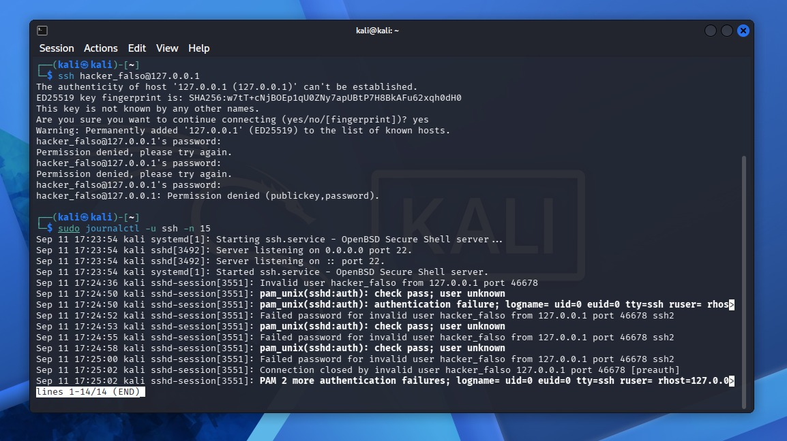

# Laboratorio de Comandos, Navegación Fundamental y Análisis de Logs SSH en Linux para SOC

## 1 - Objetivo

El objetivo de este laboratorio práctico es dominar la navegación por el sistema de archivos de Linux mediante la interfaz de línea de comandos (CLI), comprendiendo la estructura de directorios, la inspección de archivos y el análisis básico de registros de seguridad (logs SSH) para tareas de investigación en Operaciones de Ciberseguridad (Blue Team).

2 - Entorno de Trabajo y Herramientas

Sistema Operativo: Kali Linux (Entorno virtualizado con VirtualBox).

Interfaz: Terminal de comandos / Bash.

Servicios analizados: Servicio SSH (`sshd`) y registro del sistema con `journalctl`.

3 - Comandos Practicados y Funcionalidad

3.1 - Ubicación y Navegación

`pwd`: Identificación de la ruta del directorio de trabajo actual.

`ls` / `ls -la`: Listado de archivos y directorios, incluyendo archivos ocultos y detalles de permisos.

`cd`: Desplazamiento entre diferentes carpetas del sistema.

3.2 - Inspección de Archivos y Eventos de Seguridad

`cat`: Visualización del contenido completo de archivos de texto directamente en la terminal.

`ssh`: Generación de intentos de conexión hacia el entorno local.

`sudo journalctl -u ssh -n 15`: Filtrado de los últimos 15 eventos del servicio SSH para detectar intentos de acceso no autorizados.

4 - Aplicación en el Rol de Analista SOC

El dominio de la terminal y de estos comandos básicos es indispensable en ciberseguridad para:

Explorar la estructura de archivos en un sistema bajo análisis.

Identificar fallos de autenticación (Failed password) y conexiones sospechosas en tiempo real.

Sentar las bases para la investigación de incidentes y respuesta ante ataques de fuerza bruta.

5 - Evidencia Práctica en Terminal

A continuación se muestra la generación de intentos fallidos de autenticación SSH (`hacker_falso`) y la posterior verificación de los registros del sistema con `journalctl`:

6 - Próximos Pasos

Análisis profundo de registros de sistema en el directorio `/var/log`.

Filtrado avanzado de eventos de seguridad con `grep` y monitoreo en tiempo real con `tail -f`.

