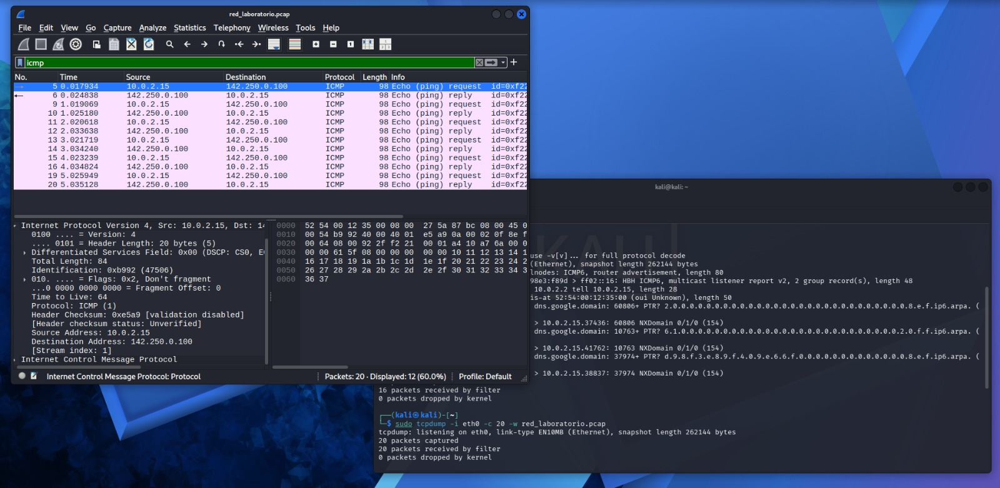
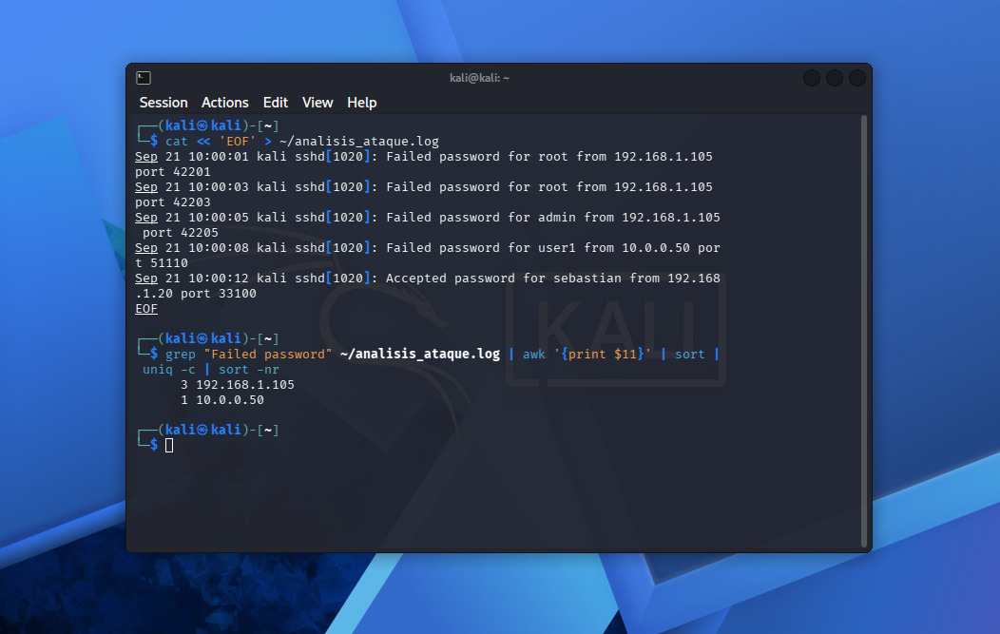

# Portafolio de Laboratorios de Ciberseguridad & Operaciones SOC (Blue Team)

Este repositorio reúne mis laboratorios prácticos orientados al rol de **SOC Analyst (Level 1 / Blue Team)**. Documenta el desarrollo de scripts en Bash para automatización, la gestión y análisis de logs del sistema Linux, y la captura e inspección de tráfico de red en un entorno de pruebas controlado.

1 - Entorno de Trabajo y Herramientas

Sistema Operativo: Kali Linux (Entorno virtualizado con VirtualBox).

Lenguaje: Bash Shell Scripting

2 - Comandos Practicados y Funcionalidad

2.1 - Ubicación y Navegación

`pwd`: Identificación de la ruta del directorio de trabajo actual.

`ls` / `ls -la`: Listado de archivos y directorios, incluyendo archivos ocultos y detalles de permisos.

`cd`: Desplazamiento entre diferentes carpetas del sistema.

2.2 - Inspección de Archivos y Eventos de Seguridad

`cat`: Visualización del contenido completo de archivos de texto directamente en la terminal.

`ssh`: Generación de intentos de conexión hacia el entorno local.

3 - Aplicación en el Rol de Analista SOC

El dominio de la terminal y de estos comandos básicos es indispensable en ciberseguridad para:

Explorar la estructura de archivos en un sistema bajo análisis.

Identificar fallos de autenticación (Failed password) y conexiones sospechosas en tiempo real.

Sentar las bases para la investigación de incidentes y respuesta ante ataques de fuerza bruta.

# Modulo 3: Monitoreo de SSH, Gestion de Servicios y Puertos de Red

## Descripcion General
En este modulo se abordan las herramientas necesarias para la inspeccion de puertos abiertos, analisis de conexiones activas en el sistema y la supervision en tiempo real del servicio SSH. Ademas, se incluye la automatizacion mediante el script monitor_ssh.sh para la deteccion de intentos de acceso.

## Comandos y Herramientas Utilizadas
- **ss -tulanp**: Inspeccion de todos los puertos TCP/UDP en escucha y procesos vinculados.
- **journalctl -u ssh -f**: Monitoreo de logs del servicio SSH gestionados por systemd en tiempo real.
- **chmod 600 id_rsa**: Asignacion de permisos estrictos para llaves privadas de autenticacion SSH.

## Evidencia de Analisis (Imagen)
La siguiente imagen (log.ssh.jpeg) muestra la captura de pantalla de la consola ejecutando el monitoreo activo de logs durante un evento de conexion, identificando los intentos de inicio de sesion registrados por el sistema:

## Módulo 4: Captura y Análisis de Tráfico de Red (`captura_red.sh`)

### Objetivo:
Aprender a capturar tráfico de red en vivo desde la terminal de Linux, exportar paquetes a formatos estándar de la industria (`.pcap`) e inspeccionar protocolos y capas OSI para análisis de eventos de seguridad en un SOC.

### Herramientas Utilizadas:
- **tcpdump**: Herramienta CLI para captura de tráfico en tiempo real.
- **Wireshark**: Analizador de protocolos de red para inspección profunda de datos.

### Procedimiento:
1. Identificación de la interfaz principal de red (`eth0`) y la dirección IP mediante `ip a`.
2. Captura de tráfico en vivo y filtrado inicial desde la terminal.
3. Exportación de paquetes a un archivo de evidencia (`red_laboratorio.pcap`).
4. Inspección de capas OSI (Capa 3 IP, Capa 4 Transporte/Control) y filtrado por protocolo (`icmp`, `dns`) en Wireshark.
5. Creación del script `captura_red.sh` para automatizar la captura de muestras de datos en la red.

# Modulo 5: SIEM (Splunk), Analisis de Logs y Triaje de Incidentes

## Objetivo
Aprender la metodologia de investigacion de eventos de seguridad aplicando filtros en la terminal de Linux y consultas en entornos SIEM (Splunk) para realizar triaje de incidentes y acciones de contencion iniciales.

## Consultas y Busquedas Integradas

### En Terminal de Linux (Procesamiento de Logs)
- Top IPs con intentos de acceso:
  `cat access.log | awk '{print $1}' | sort | uniq -c | sort -nr | head -n 10`
- Verificacion de inicio de sesion exitoso:
 ` grep "10.0.0.55" /var/log/auth.log | grep -i "Accepted"`

### En Splunk (Sintaxis SPL)
- Ataques de fuerza bruta: `index=main sourcetype=syslog "Failed password" | stats count by src_ip | sort - count`
- Confirmacion de compromiso: `index=main src_ip="10.0.0.55" "Accepted password"`

## Playbook de Contencion Aplicado
1. Bloqueo en Firewall: `sudo iptables -A INPUT -s IP_ATACANTE -j DROP`
2. Aislamiento de red: `sudo ip link set dev eth0 down`
3. Congelamiento de cuenta comprometida: `sudo passwd -l usuario`
4. Terminacion de sesiones activas: `sudo pkill -u usuario`

# Modulo 6: Inspeccion de Trafico de Red con tcpdump y Wireshark

## Objetivo
Capturar y analizar paquetes de red en archivos .pcap para identificar trafico no cifrado, inspeccion de protocolos y deteccion de exfiltracion de credenciales.

## Captura en Consola (tcpdump)
- Capturar trafico de una interfaz a archivo:
  `sudo tcpdump -i eth0 -w captura.pcap`
- Inspeccionar archivo .pcap en terminal:
  `sudo tcpdump -r captura.pcap`

## Filtros Clave para Wireshark (GUI)
- Trafico completo de una IP: `ip.addr == 192.168.1.105`
- Inspeccion de peticiones HTTP (Texto plano): `http`
- Busqueda de credenciales/formularios: `http.request.method == "POST"`
- Consultas de nombres de dominio: `dns`

## Conclusion del Analisis
Mediante la inspeccion de tramas HTTP (Puerto 80), es posible extraer campos en texto claro como parametros de usuarios y contraseñas enviadas en formularios web no seguros, resaltando la necesidad del uso obligatorio de TLS/HTTPS (Puerto 443).

# Módulo 7: Análisis de Malware e Indicadores de Compromiso (IoCs)

## Descripción General
Documentación técnica sobre la clasificación de software malicioso y los procedimientos operativos estándar en un Centro de Operaciones de Seguridad (SOC) para la identificación, extracción de evidencias y contención de amenazas.

---

## 1. Clasificación de Amenazas (Malware)
* **Ransomware:** Cifrado no autorizado de datos con fines de extorsión.
* **InfoStealer / Spyware:** Exfiltración de credenciales, tokens de sesión y datos sensibles.
* **Trojan (Troyano):** Enmascaramiento de código malicioso dentro de ejecutables aparentes de uso legítimo.
* **Worm (Gusano):** Propagación autónoma en red aprovechando vulnerabilidades.
* **Rootkit:** Ocultamiento a nivel de kernel para evasión de soluciones de seguridad (AV/EDR).

---

## 2. Indicadores de Compromiso (IoCs)
Evidencias digitales clave para la confirmación e investigación de un incidente:

| Tipo de IoC | Ejemplo / Formato | Uso en el SOC |
| :--- | :--- | :--- |
| **Identificación de Archivo** | SHA-256, MD5 | Identificación exacta del binario en VirusTotal / EDR. |
| **Red (C2)** | Direcciones IP, Dominios, URLs | Bloqueo perimetral en Firewall, Proxy y DNS Sinkhole. |
| **Host** | Rutas temporales (%APPDATA%), Claves de Registro (Run) | Aislamiento, limpieza y reglas de detección local. |

---

## 3. Flujo Operativo de Triaje en el SOC

1. **Extracción de Hash:**
   * PowerShell: `Get-FileHash -Algorithm SHA256 .\archivo.exe`
   * Linux: `sha256sum archivo.exe`
2. **Análisis Estático:** Consulta de reputación mediante firmas en VirusTotal.
3. **Análisis Dinámico (Sandbox):** Observación del comportamiento en entornos aislados (ANY.RUN, Hybrid Analysis).
4. **Contención:** Aislamiento lógico de la estación de trabajo mediante el EDR y actualización de listas de bloqueo.

---

## Estado del Módulo
- [x] Conceptos de Malware e IoCs
- [x] Flujo de Triaje y Análisis
- [x] Casos de Práctica y Extracción de IoCs

# Módulo 8: Análisis de Phishing e Investigación de Cabeceras (Headers)

## Descripción General
Documentación técnica sobre el procedimiento operativo estándar en un Centro de Operaciones de Seguridad (SOC) para el análisis de correos electrónicos sospechosos, verificación de autenticación de dominios y contención de campañas de Phishing.

---

## 1. Capas de Inspección en el Análisis de Correo

* **Cabecera (Email Header):** Metadatos e información de enrutamiento que permiten validar la IP de origen y los registros de autenticación del emisor.
* **Cuerpo y URLs:** Evaluación de técnicas de ingeniería social y extracción de enlaces orientados al robo de credenciales (Credential Harvesting).
* **Archivos Adjuntos:** Identificación de payloads maliciosos (ej: ejecutables, documentos con macros, archivos comprimidos).

---

## 2. Validación de Autenticación de Dominio

Mecanismos clave para detectar suplantación de identidad (Email Spoofing) en la cabecera del mensaje:

| Mecanismo | Función Principal | Criterio de Verificación |
| :--- | :--- | :--- |
| **SPF (Sender Policy Framework)** | Lista de IPs autorizadas para enviar correos en nombre de un dominio. | FAIL indica que la IP emisor no está autorizada por el dominio. |
| **DKIM (DomainKeys Identified Mail)** | Firma criptográfica que garantiza la integridad del contenido del mensaje. | FAIL indica alteración del mensaje en tránsito o firma inválida. |
| **DMARC** | Política del dominio para la gestión de mensajes que fallan SPF o DKIM. | Determina si el correo se rechaza (reject) o se entrega. |

---

## 3. Flujo Operativo de Triaje en el SOC

1. **Recepción del Ticket:** Extracción del archivo del correo (.eml / .msg) adjunto en la plataforma de tickets.
2. **Análisis de Cabecera:** Extracción de headers y procesamiento en herramientas de análisis (ej: Google Admin Toolbox Header Analyzer, MXToolbox).
3. **Inspección Segura de URLs:** Evaluación de enlaces sospechosos mediante entornos sandbox web aislados (URLScan.io, VirusTotal) sin ejecución directa.
4. **Verificación de Adjuntos:** Extracción de hashes (SHA-256) de archivos adjuntos para consulta de reputación.

---

## 4. Medidas de Contención

En caso de confirmar un **Verdadero Positivo (TP)** de Phishing:
* **Bloqueo Perimetral:** Incorporación del dominio, IP de origen y URLs a las listas de bloqueo del Firewall/Proxy.
* **Purga de Buzones:** Búsqueda y eliminación remota del correo en todos los buzones de la organización (M365 / SIEM).
* **Notificación:** Cierre del ticket informando al usuario la neutralización de la amenaza.

---

## Conclusión y Aprendizaje
Comprensión del flujo de análisis de correo electrónico y de los mecanismos de autenticación SPF, DKIM y DMARC. La correcta interpretación de las cabeceras de correo y el uso de entornos sandbox permiten identificar intentos de suplantación de identidad y contener campañas de phishing antes de que afecten la infraestructura de la organización.

---

## Estado del Módulo
- [x] Conceptos de Phishing e Ingeniería Social
- [x] Análisis de Cabeceras (SPF / DKIM / DMARC)
- [x] Inspección de URLs e IoCs en Sandbox (URLScan.io)
- [x] Playbook de Contención y Respuesta en el SOC

# Módulo 9: Análisis de Registros de Auditoría y Detección de Fuerza Bruta SSH

## Descripción del Proyecto
Este laboratorio práctico forma parte del Módulo 9 del plan de estudio para Analista SOC Nivel 1. Está enfocado en el análisis de registros del sistema (`/var/log/auth.log`) para la detección de tráfico anómalo e intentos de autenticación fallida vía protocolo SSH, con el objetivo de aislar indicadores de compromiso (IoC) e identificar direcciones IP sospechosas asociadas a patrones de ataque por fuerza bruta en entornos Linux.

## Metodología y Procesamiento
El análisis se ejecutó en un entorno Kali Linux aplicando filtrado y procesamiento de datos mediante la línea de comandos (Bash):

1. **Filtrado de eventos:** Identificación de intentos fallidos de autenticación en los registros del sistema.
2. **Aislamiento de variables:** Extracción de las direcciones IP de origen asociadas a los eventos de fallo.
3. **Consolidación de datos:** Agrupación, conteo y jerarquización de las direcciones IP según su frecuencia de aparición para identificar la fuente del tráfico malicioso.

## Resultado de la Investigación
A través del procesamiento del registro, se logró identificar una dirección IP específica con un volumen elevado de intentos fallidos en un intervalo reducido de tiempo, evidenciando un patrón de ataque por fuerza bruta.

### Evidencia de Ejecución

## Aplicación en Entornos SOC
Este procedimiento simula las tareas fundamentales de un Analista SOC Nivel 1 para:
- Generación de Indicadores de Compromiso (IoC).
- Identificación de orígenes de ataque para su posterior bloqueo preventivo en firewall corporativo.
- Creación de reglas de correlación e integración de alertas en sistemas SIEM.
